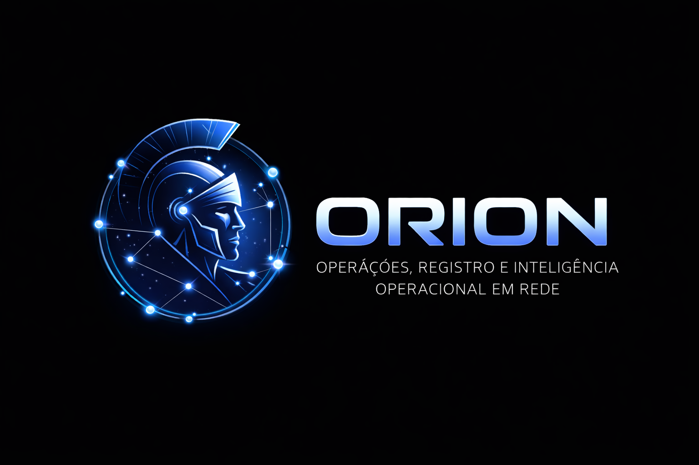

# ORION System



O ORION System e um ecossistema em construcao para operacao, governanca, controle e inteligencia de rotinas sensiveis. O projeto nasce com foco em registro operacional estruturado, rastreabilidade, auditabilidade, seguranca de acesso e preparacao de dados para analise gerencial.

Mais do que um painel administrativo, o ORION esta sendo desenhado como uma base de operacao orientada por regras de negocio, pronta para evoluir para indicadores, monitoramento tatico e leitura executiva em um segundo produto analitico.

## Visao do ecossistema

O repositorio concentra dois produtos complementares:

- app-operacional: aplicacao Laravel principal, responsavel pela camada transacional, cadastros, fluxos operacionais, seguranca, auditoria e registro estruturado.
- app-painel: espaco reservado para o futuro painel analitico do ecossistema ORION, com proposta visual inspirada em experiencias de BI e leitura executiva de indicadores.

## O que o ORION entrega nesta fase

O estado atual do projeto ja cobre a base visual, navegacional e conceitual do sistema operacional:

- dashboard executivo inicial e dashboard interno com leitura rapida da operacao;
- modulo de ocorrencias com formulario estruturado por tipificacao, localizacao, envolvidos, itens e historico operacional;
- modulo de produtividade para acompanhamento de entregas e volume operacional;
- gestao de unidades com hierarquia, cobertura territorial e preparacao para georreferenciamento;
- gestao de usuarios com perfil funcional, tipo de acesso, escopo e restricoes;
- area de tipificacoes para governar comportamento de formularios e padronizacao de dados;
- modulos de auditoria e seguranca para trilha sensivel, eventos e visibilidade administrativa;
- area de configuracoes e autoatendimento da conta do usuario;
- tabelas padronizadas com DataTables, busca, paginacao e acoes por linha;
- identidade visual propria, layout fixo, navegacao administrativa consistente e base frontend em TypeScript.

## Diretrizes de negocio ja incorporadas

O ORION ja foi modelado com algumas decisoes estruturais importantes:

- tipificacao governa o comportamento do formulario e a qualidade do registro;
- envolvidos e itens precisam nascer de forma analitica para sustentar BI e painis futuros;
- enderecos devem ser estruturados para permitir consolidacao territorial e cruzamentos;
- unidades precisam suportar hierarquia pai-filho e escopo com descendentes;
- seguranca deve separar perfil, tipo de acesso e escopo de visibilidade;
- auditoria deve registrar inclusao, alteracao, validacao, bloqueio e leitura sensivel.

## Arquitetura atual

- Backend: Laravel 12
- Frontend server-side: Blade
- Build e assets: Vite 7
- Interatividade: TypeScript, jQuery 4 e DataTables 2
- Estilo visual: tema administrativo ORION com componentes proprios
- Base atual: prototipacao funcional pronta para evolucao para controllers, persistencia e politicas reais

## Estrutura do repositorio

```text
app-orion/
|-- app-operacional/
|-- app-painel/
|-- README.md
```

Observacoes importantes:

- este repositorio versiona apenas o ecossistema ORION em desenvolvimento;
- os diretorios eleicoes-backend e eleicoes-urna foram mantidos localmente apenas como referencia anterior de modelagem e nao fazem parte da entrega publicada;
- o foco atual esta na consolidacao do produto operacional antes da expansao analitica do painel.

## Como executar o app-operacional

Entre em app-operacional e execute:

```bash
composer install
copy .env.example .env
php artisan key:generate
npm install
php artisan serve
npm run dev
```

Se quiser usar o fluxo completo preparado pelo composer:

```bash
composer run setup
```

O setup atual cria a base Laravel, gera a chave da aplicacao, executa migracoes e prepara o frontend.

## Comandos uteis

```bash
npm run dev
npm run build
npm run typecheck
php artisan test
```

## Base minima para homologacao e producao

Para publicar a aplicacao com seguranca minima, o recomendado e:

- configurar APP_ENV=production e APP_DEBUG=false;
- apontar APP_URL para o dominio real do ambiente;
- substituir sqlite por mysql ou postgres conforme a infraestrutura definitiva;
- configurar cache, fila, sessao e mail conforme o ambiente alvo;
- executar build do frontend com npm run build;
- revisar permissoes de armazenamento e cache do Laravel;
- definir estrategia de backup, logs e retencao de trilha de auditoria.

## Roadmap funcional

Proximos passos previstos para o ORION:

- substituir mocks por controllers, servicos e consultas reais;
- criar migrations e modelagem persistente para catalogos, territorialidade, usuarios, escopos, auditoria, notificacoes e ocorrencias;
- aplicar autenticacao real, middleware e policies por perfil e escopo;
- conectar anexos, historico e eventos a armazenamento persistente;
- consolidar KPIs operacionais para abastecer o futuro app-painel;
- evoluir para um painel gerencial com leitura de desempenho, tendencia, risco e produtividade em estilo BI.

## Posicionamento do projeto

O ORION esta sendo construido para servir como uma plataforma institucional de controle operacional e inteligencia aplicada. Nesta etapa, o repositorio ja apresenta um produto com identidade, estrutura de navegacao, modulos principais e regras de negocio embrionarias suficientemente claras para demonstracao, refinamento funcional e aceleracao da fase de backend.